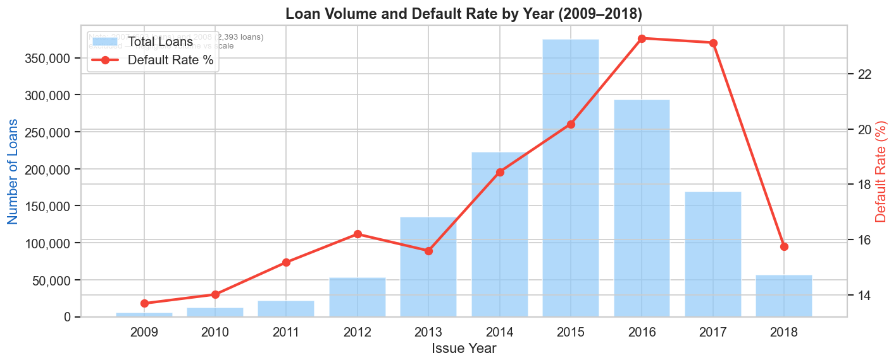
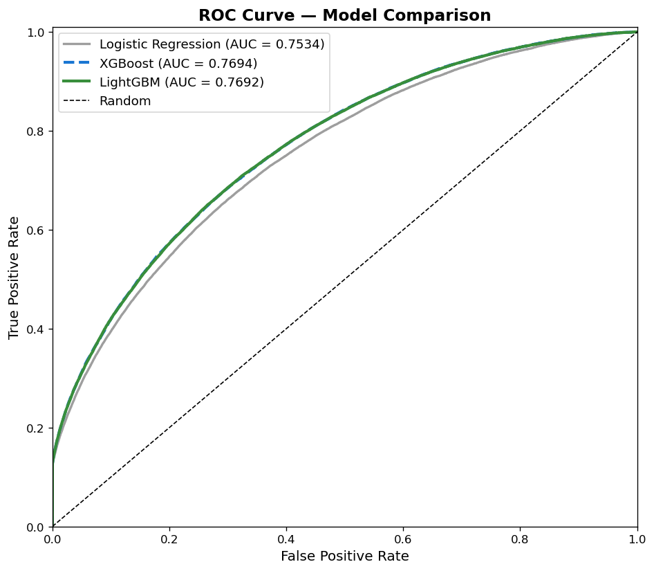
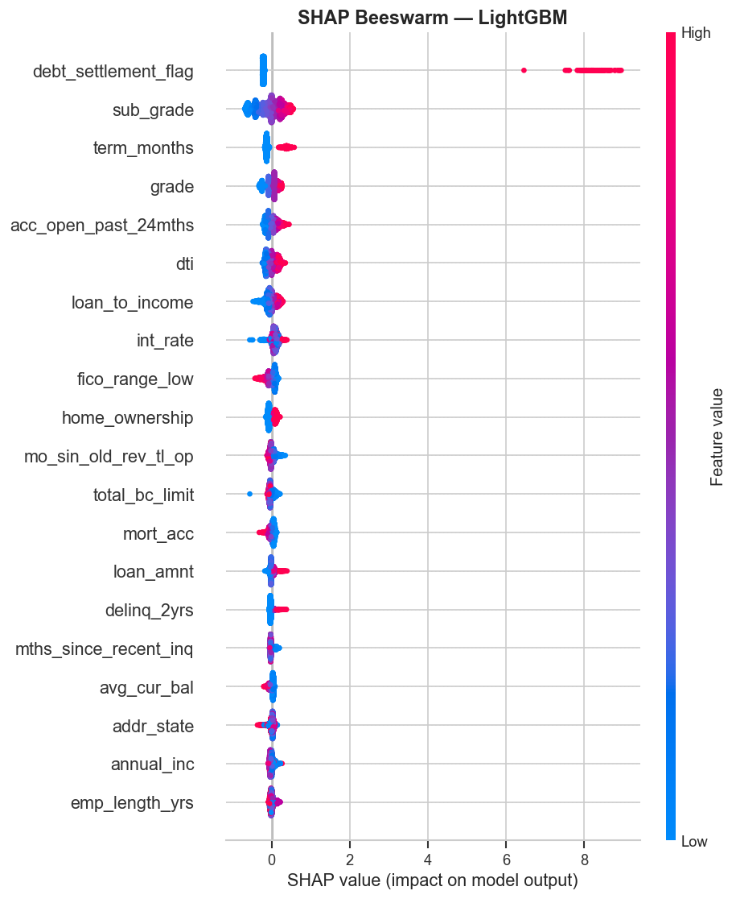

# Credit Risk Prediction — Lending Club (2007–2018)

Predicting consumer loan default on **1.34 million real loan records** using interpretable machine learning.  
**Stack**: Python · XGBoost · LightGBM · Optuna · SHAP · Scikit-learn · Pandas · Matplotlib

---

## Business Context

The 2008 Global Financial Crisis demonstrated the systemic cost of mispriced credit risk. In its aftermath, regulators (Basel III, Dodd-Frank) and lenders alike shifted toward data-driven underwriting — replacing static rules with models that can price risk at the individual borrower level.

This project builds a **pre-origination credit default model** using Lending Club's public loan data. Every feature used is available *at the time of application* — no post-disbursement payment behavior is used, ensuring the model is deployment-realistic.

The model addresses three practical goals:
1. **Discriminate** good borrowers from bad before a loan is issued
2. **Interpret** predictions using SHAP to satisfy regulatory explainability requirements
3. **Validate** model logic against established economic theory — confirming the model has learned real credit risk structure, not statistical artifacts

---

## Dataset

| Property | Value |
|---|---|
| Source | [Lending Club Loan Data — Kaggle](https://www.kaggle.com/datasets/wordsforthewise/lending-club) |
| Period | 2007 Q1 – 2018 Q4 |
| Raw rows | ~1.8M loans, 151 features |
| After filtering | Closed loans only (Fully Paid + Charged Off): **1,348,059 loans** |
| Default rate | 19.98% — moderate class imbalance |
| Target | `1` = Charged Off (default), `0` = Fully Paid |

---

## EDA: What Drives Default?

### The Class Imbalance Problem


~20% of closed loans were charged off. This moderate imbalance guided key modeling decisions: `scale_pos_weight` in XGBoost, `class_weight='balanced'` in LightGBM, and the use of **ROC-AUC and Average Precision** — rather than accuracy — as evaluation metrics (accuracy is misleading when classes are unequal).

---

### Default Rate Across Economic Cycles



The chart starts from 2009 because 2007 (603 loans) and 2008 (2,393 loans) represent negligible volume compared to peak years (400K+) and would be invisible on the same scale. Lending Club launched in May 2007 and only reached statistical significance from 2009 onward.

Default rates were highest in **2009–2011** (the tail of the Global Financial Crisis), then declined steadily as Lending Club tightened underwriting standards. Loan volume grew dramatically from 2012, reflecting the platform's rapid scaling during the post-crisis low-rate environment.

The cyclical pattern carries an important modeling lesson: a credit model trained only on post-2013 boom-period data would underestimate systemic risk. Including the 2009–2011 stressed period gives the model exposure to both credit deterioration and recovery, producing a more robust estimator.

---

### Lending Club's Grade System: Useful, But Insufficient


Lending Club's internal grade system (A = lowest risk → G = highest) correctly ranks default rates from ~5% (Grade A) to ~35% (Grade G). The monotonic increase validates the grade system's directional accuracy.

However, even Grade A carries a ~5% default rate — and Grade B (~10%) still represents substantial risk for a lender at scale. This demonstrates that **the grade system alone is insufficient** for fine-grained risk pricing. A borrower-level model that captures within-grade variation is exactly where machine learning adds value over traditional scorecard approaches.

---

### Loan Purpose as a Structural Risk Signal


Loan purpose is a strong categorical risk signal:

- **Small business loans** carry the highest default rate (~27%), consistent with U.S. SBA data showing roughly 50% of small businesses fail within 5 years. Credit extended to businesses inherits the business's survival risk.
- **Debt consolidation** — the most common purpose — sits near the average, reflecting a heterogeneous pool of borrowers.
- **Credit card refinancing** borrowers show relatively lower risk, likely due to self-selection: only credit-aware borrowers seek to consolidate high-rate balances at lower rates.

This pattern illustrates **adverse selection by loan purpose**: borrowers with the most urgent need for credit (small business, medical) are systematically higher risk.

---

## Modeling

### Why These Three Models

Three models were selected to represent a deliberate progression from interpretability to predictive power:

| Model | Rationale |
|---|---|
| **Logistic Regression** | The traditional credit scorecard model. Interpretable, auditable, and preferred by regulators under Basel II. Sets a principled performance baseline — any gain from more complex models must be justified against this floor. |
| **XGBoost** | Captures non-linear risk interactions that logistic regression cannot (e.g., DTI risk is convex — low DTI is safe, but risk accelerates disproportionately above a threshold). Handles missing values natively. Industry standard for tabular credit data. |
| **LightGBM** | Leaf-wise splitting is 3–5× faster than XGBoost on datasets with 1M+ rows, with comparable AUC. In production, model training and retraining frequency are engineering constraints — LightGBM's speed advantage is a real operational consideration, not just benchmark performance. |

### Hyperparameter Tuning with Optuna

Hyperparameters were optimized using **Optuna** (Bayesian optimization, TPE sampler) rather than manual selection or exhaustive grid search — which would be computationally prohibitive on 1.34M records.

| Decision | Rationale |
|---|---|
| Search on 10% subsample (~107K loans) | Reduces search time from hours to minutes while preserving the training distribution |
| 50 trials per model | TPE sampler converges efficiently; diminishing returns beyond 50 trials at this scale |
| Retrain on full data | Best parameters from subsample search applied to the full 1.07M-loan training set for final evaluation |

**Parameters tuned**: `n_estimators`, `max_depth`, `learning_rate`, `subsample`, `colsample_bytree`, `reg_alpha`, `reg_lambda` + model-specific: `min_child_weight`, `gamma` (XGBoost); `num_leaves`, `min_child_samples` (LightGBM).

### Results

Evaluated on **225,611 loans originated in 2017–2018** (out-of-time holdout) — the model is trained exclusively on 2007–2016 data and validated on genuinely future loans it has never seen. The test set carries a slightly higher default rate (21.28% vs 19.72% in training), reflecting Lending Club's credit quality trajectory in its late expansion phase.

| Model | ROC-AUC | Avg Precision |
|---|---|---|
| Logistic Regression (baseline) | 0.7334 | 0.4772 |
| XGBoost + Optuna | 0.7496 | 0.5030 |
| **LightGBM + Optuna** | **0.7505** | **0.5045** |

**KS Statistic (LightGBM): 0.3571**

**Interpreting the numbers:**

- **Out-of-time validation**: AUC is approximately 0.015–0.016 lower than random-split benchmarks — the expected cost of genuine temporal holdout. Models are evaluated on a distribution shift (different economic cycle, different underwriting vintage), not just a random sample of the same data. This produces a more honest estimate of real deployment performance.
- **LR → tree model gap (+0.017 AUC)**: Confirms that credit default has non-linear structure. DTI and FICO interact with other variables in ways a linear model cannot capture — and this non-linearity persists out-of-time, validating that the tree models have learned genuine credit risk structure rather than overfitting the training period.
- **XGBoost vs LightGBM (0.001 AUC)**: Essentially identical predictive power. At this margin, **LightGBM's 3–5× training speed** is the decisive factor for any production deployment requiring frequent retraining.
- **KS = 0.3571**: A KS above 0.30 is considered acceptable in banking for consumer credit; above 0.40 is strong. The remaining gap suggests that additional data sources — bank transaction history, employment verification, rent payment records — could close it. This is a known limitation of public-source credit data.



The ROC curve shows that tree models meaningfully outperform logistic regression across all operating thresholds, not just at a single cutoff — indicating robust, structurally superior discrimination rather than threshold-specific overfitting.


The score distribution confirms the model's separation power: charged-off loans (red) are assigned higher predicted default probabilities than fully-paid loans (green). The overlap region defines the irreducible error — borrowers whose observable characteristics are similar regardless of outcome.

---

## Business & Economic Insights

SHAP (SHapley Additive exPlanations) decomposes each prediction into the contribution of individual features, satisfying the explainability requirements that regulators increasingly demand for credit decisions.



### Interest Rate: Adverse Selection in Action

Interest rate is the strongest default predictor in the model — but the mechanism is not direct causation. Lending Club **sets rates based on perceived borrower risk**, so interest rate already encodes the platform's own risk assessment. High-rate borrowers also face higher monthly burdens, increasing cash flow stress.

This reflects a classic **adverse selection loop** (Stiglitz & Weiss, 1981): riskier borrowers are willing to accept high-rate loans that lower-risk borrowers would reject, confirming their riskiness, which drives rates even higher. The model correctly learns this signal, but practitioners should be aware that using interest rate as a feature creates a dependency on Lending Club's internal rating — which may not be available in an independent credit model.

### FICO Score: Validated Against Regulatory Credit Tiers

FICO has a strongly negative SHAP effect across all borrowers — higher scores reduce default probability monotonically. Crucially, the model's behavior aligns with established regulatory tiers:

- **FICO < 620** (subprime): Sharp SHAP spike — highest marginal risk
- **FICO 620–679** (near-prime): Transitional, moderate risk
- **FICO ≥ 720** (prime): Near-zero or negative SHAP contribution

This alignment with regulatory definitions is an important model validation signal: the model has not just fit statistical patterns but has learned **economically meaningful credit risk structure**.

### DTI: Empirical Support for the Dodd-Frank Threshold

Debt-to-Income ratio is a top-3 positive risk driver. Borrowers with high DTI are stretched thin — each additional dollar of loan commitment increases the probability of cash flow failure.

Under **Dodd-Frank's Ability-to-Repay rule**, DTI > 43% is the regulatory threshold for "qualified mortgage" status. Our SHAP analysis confirms that the same threshold region is where DTI contributions to default risk accelerate — providing empirical validation of regulatory intuition using market data rather than prescribed rules.

### Sub-Grade: The Value of Granularity

Lending Club's sub-grade (A1–G5, representing 35 risk buckets) carries substantial SHAP values beyond what the main grade captures. This means the **finest level of Lending Club's internal grading contains real predictive signal** — lenders who price only at the grade level are leaving risk information on the table.

### Credit History Length: A Survivorship Effect

Longer credit history reduces default probability. The economic mechanism is a **survivorship effect**: borrowers who have maintained credit accounts for many years without defaulting have already passed an implicit endurance test. The model correctly interprets credit history length as a proxy for demonstrated financial discipline, not merely as a demographic variable.

---

## Optimal Decision Threshold

A model score is not a lending decision. Converting probabilities into approve/reject decisions requires choosing a threshold — and the choice of threshold is a **business optimization problem**, not a statistical one.

The default 0.5 threshold implicitly assumes that misclassifying a good borrower (False Positive) costs the same as misclassifying a bad borrower (False Negative). In consumer credit, this is incorrect by a wide margin:

| Error type | Business consequence | Estimated cost |
|---|---|---|
| False Negative (approve bad loan) | Default loss after recovery | avg **$13,628** per loan |
| False Positive (reject good loan) | Foregone interest income | avg **$3,594** per loan |
| **Implied cost ratio** | | **3.8× — FN far more costly** |

We sweep all thresholds from 0.01 to 0.99 and compute the expected portfolio P&L at each cutoff using actual `loan_amnt` and `int_rate` from the 2017–2018 test set (225,611 loans). The P&L formula per threshold *t*:

```
P&L(t) = Σ profit_i  [approved & actually good]
        − Σ loss_i   [approved & actually bad]
```


**Results:**

| Threshold | Portfolio P&L | Approval Rate |
|---|---|---|
| Approve all (no model) | −$16.1M | 100% |
| Default t = 0.50 | $101.1M | ~75% |
| **Optimal t\* = 0.538** | **$104.1M** | **69.5%** |

The optimal threshold is **t\* = 0.538** — slightly above 0.5, reflecting the asymmetric cost structure. At this cutoff, 69.5% of applicants are approved, and the model generates **$3.0M more** than the 0.5 baseline on this test cohort alone. Against the naïve approve-all strategy, the model adds **$120.2M** in avoided losses.


At t\* = 0.538, the model improves overall accuracy from 70% to 73% and better balances precision and recall across both classes — the practical result of aligning the decision boundary with real economic costs rather than the arbitrary midpoint of the probability scale.

---

## Probability Calibration

A model that ranks borrowers well (high AUC) does not necessarily produce well-calibrated probabilities. Calibration asks: *when the model predicts "30% default risk," do approximately 30% of those borrowers actually default?*

| Metric | Value | Interpretation |
|---|---|---|
| Brier Score | 0.1933 | Mean squared error of probability forecasts |
| Naive baseline | 0.1675 | Brier score of always predicting the base rate (21.3%) |
| Brier Skill Score | −0.15 | Model probabilities are **less accurate** than the baseline |


The negative Brier Skill Score reveals that while the model **discriminates** well between good and bad borrowers (AUC = 0.75), its **predicted probabilities are inflated** — a known side effect of `class_weight='balanced'`, which pushes predicted scores higher to compensate for class imbalance. The model ranks correctly but overstates default probability in absolute terms.

**Production implication**: For rank-ordering and threshold-based decisions (approve/reject), AUC is the correct metric and the model performs well. For **risk-based pricing** — where the raw probability directly determines the interest rate charged — a calibration step (Platt scaling or isotonic regression) would be required before deployment to ensure the P&L calculations reflect true default rates.

---

## Fairness & Disparate Impact Analysis

US credit regulation (ECOA, Fair Housing Act) prohibits lending models that produce **disparate impact** on protected groups. We apply the **EEOC 80% rule**: a group with an approval rate below 80% of the best-approved group's rate is flagged — then cross-validated against actual default rates to distinguish risk-driven rejection from unjustified disparity.


| Purpose | Approval Rate | Default Rate | DI Ratio | Assessment |
|---|---|---|---|---|
| car | 82.4% | 15.5% | 1.00 (ref) | Low risk, high approval |
| credit_card | 75.3% | 18.4% | 0.91 | Acceptable |
| **debt_consolidation** | **65.7%** | **22.3%** | **0.80** | Borderline — warrants monitoring |
| **small_business** | **48.9%** | **36.1%** | **0.59** | Below DI threshold, but justified |

**Key finding**: `small_business` falls below the 0.80 DI threshold (approval rate 48.9% vs 82.4% for car loans), but its actual default rate is **36.1% — more than twice the portfolio average**. The disparity is **risk-driven, not arbitrary**: the model is correctly identifying that small business loans carry substantially higher credit risk, consistent with SBA data showing ~50% of small businesses fail within 5 years.

`debt_consolidation` (DI = 0.80, borderline) merits monitoring: its default rate (22.3%) is near the portfolio average, yet approval rates are lower. This may reflect correlated risk factors (e.g., high DTI) that the model correctly penalizes, but should be reviewed against protected-class proxies in a full fair lending audit.

---

## Feature Distribution Drift (PSI)

**Population Stability Index (PSI)** is the banking industry standard for monitoring whether a deployed model's input features have shifted between training and scoring windows — a prerequisite for knowing when to retrain.


All 15 top SHAP features show **PSI < 0.10** (stable), with the highest being `mo_sin_old_rev_tl_op` at 0.090. This indicates that the 2017–2018 borrower population observable characteristics are statistically similar to the 2007–2016 training population.

**Implications**:
- The OOT performance decline (AUC 0.75 vs ~0.77 on random split) is attributable to **economic and policy changes** in the lending environment, not feature distribution drift
- The model does not require immediate retraining due to feature shift — the degradation is structural (different vintage, credit cycle) rather than distributional
- In production, PSI monitoring would be automated on a monthly basis; the PSI = 0.25 threshold would trigger a retraining decision

---

## Feature Engineering

Raw features were cleaned and augmented with five engineered variables that encode economic relationships:

| Feature | Construction | Economic rationale |
|---|---|---|
| `loan_to_income` | `loan_amnt / (annual_inc + 1)` | Leverage ratio — how large is this obligation relative to annual earnings |
| `installment_to_income` | `installment / (annual_inc / 12 + 1)` | Monthly cash flow burden — a more direct measure of repayment stress than DTI alone |
| `credit_history_months` | Months from `earliest_cr_line` to `issue_d` | Duration of demonstrated credit management |
| `term_months` | Parsed from `term` string | Numeric loan duration (36 or 60 months) |
| `emp_length_yrs` | Parsed from `emp_length` string | Income stability proxy |

**Dropped features**: 18 post-origination columns (payment history, recovery amounts) to prevent target leakage; 40+ joint application fields (>50% missing); free-text fields (url, desc, emp_title).

---

## Methodology

```
Raw Data: 1.8M rows, 151 features
    ↓ Filter: keep Fully Paid + Charged Off → 1,348,059 loans
    ↓ Drop: leakage columns, >50% missing fields, free-text
    ↓ Engineer: 5 new features (loan_to_income, installment_to_income, etc.)
    ↓ Encode: 12 categorical features via Label Encoding
    ↓ Impute: remaining NaN → column median
    ↓ Split: temporal — train on 2007–2016, test on 2017–2018 (out-of-time validation)
    ↓
    Logistic Regression (balanced weights) → baseline AUC: 0.7334
    Optuna (50 trials, TPE, 10% subsample) → XGBoost best params
    Optuna (50 trials, TPE, 10% subsample) → LightGBM best params
    ↓ Retrain both on full training set with best params
    ↓
    SHAP TreeExplainer → global importance (beeswarm) + dependence plots
    KS Statistic → banking-standard score separation metric
```

---

## Interactive Demo (Streamlit)

The pre-trained model is included in the repo (`lgbm_model.pkl`). Run the interactive demo without downloading the dataset or retraining:

```bash
git clone https://github.com/proverb27515/credit_risk_lending.git
cd credit_risk_lending
pip install -r requirements.txt
streamlit run app.py
```

Enter loan amount, interest rate, FICO score, DTI, and other borrower details to receive a real-time credit decision with SHAP feature attribution.

---

## How to Reproduce from Scratch

```bash
# 1. Clone the repo
git clone https://github.com/proverb27515/credit_risk_lending.git
cd credit_risk_lending

# 2. Install dependencies (Anaconda recommended on Apple Silicon)
pip install -r requirements.txt

# 3. Download dataset from Kaggle and place in project root
#    File: accepted_2007_to_2018Q4.csv.gz
#    https://www.kaggle.com/datasets/wordsforthewise/lending-club

# 4. Run notebooks in order
jupyter notebook
# → 1_eda.ipynb        (EDA + visualizations)
# → 2_modeling.ipynb   (Feature engineering + Optuna + SHAP + saves model artifacts)
```

> **Apple Silicon (M1/M2) note**: XGBoost and LightGBM require `libomp`. Use Anaconda Python with the `anaconda-m1` kernel — both libraries work natively on arm64.

---

## Skills Demonstrated

`Machine Learning` · `Credit Risk Modeling` · `Hyperparameter Optimization (Optuna)` · `SHAP Interpretability` · `Feature Engineering` · `Class Imbalance Handling` · `Fairness Analysis (ECOA/EEOC)` · `Model Calibration` · `Feature Drift (PSI)` · `Economic Theory Application` · `Data Visualization` · `Streamlit` · `Python` · `XGBoost` · `LightGBM` · `Pandas` · `Scikit-learn`
